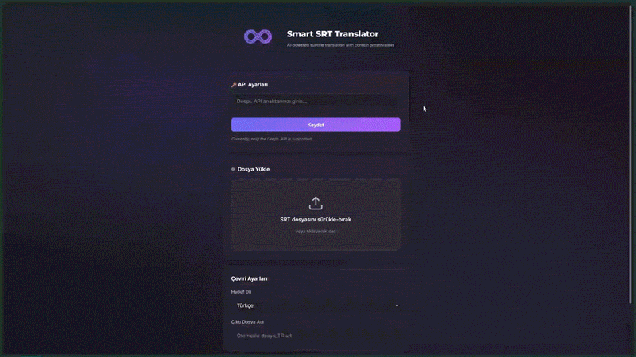

# 🎬 Smart SRT Translator

<p align="center">
  
</p>

<p align="center">
  <strong>AI-powered subtitle translation with context preservation</strong>
</p>

<p align="center">
  <a href="#features">Features</a> •
  <a href="#the-problem">The Problem</a> •
  <a href="#how-it-works">How It Works</a> •
  <a href="#installation">Installation</a> •
  <a href="#usage">Usage</a> •
  <a href="#api-reference">API</a> •
  <a href="#contributing">Contributing</a>
</p>

---

## ✨ Features

- 🧠 **Smart Sentence Merging** – Uses SpaCy NLP to detect sentence boundaries across subtitle blocks
- 🔄 **Context-Aware Translation** – Translates complete sentences, not fragmented blocks
- ⚡ **Proportional Splitting** – Redistributes translations back to original timestamps using character ratios
- 🌍 **29+ Languages** – Powered by DeepL API with support for major world languages
- 🎨 **Modern Web UI** – Dark glassmorphism theme with drag-and-drop file upload
- 📊 **Real-time Progress** – Server-Sent Events (SSE) for live translation status updates
- 🔐 **Secure** – API keys stored locally, never transmitted to third parties
- 🛠️ **Multi-Model Support** – Install multiple SpaCy language models for different source languages
- 🔍 **Auto Language Detection** – Automatically detects source file language
- ⚠️ **Smart Warnings** – Alerts for language mismatches and same language selections

---

## 🎥 Demo

<p align="center">
  
</p>

---

## 🎯 The Problem: Why Context Matters?

### Turkish → English Example

Turkish sentence structure places the verb at the end. When subtitles split a sentence into multiple lines, standard translators fail to capture the meaning of the first line because the action (verb) is missing until the end.

**Original (Split in 3 lines):**
> 1. Bütün bu olanlardan
> 2. sonra, beni affetmeni
> 3. beklemiyorum.

| Method | Output (Subtitle) | Why it fails/succeeds? |
| :--- | :--- | :--- |
| **Standard (Line-by-Line)** | 1. From all these things<br>2. after, to forgive me<br>3. **I am not waiting.** | ❌ **FAIL:** "Beklemiyorum" is translated as "waiting" physically, instead of "expecting". The sentence is broken and meaningless. |
| **SRT Smart Translator** | 1. After all that has happened,<br>2. I do not expect<br>3. you to forgive me. | ✅ **SUCCESS:** It merges lines, understands "affetmeni beklemiyorum" implies expectation, translates correctly, and re-splits by timing. |

---

## 💡 How It Works

Smart SRT Translator uses a 4-step pipeline:

```
┌──────────┐    ┌──────────┐    ┌──────────┐    ┌──────────┐
│  Parse   │───▶│  Merge   │───▶│Translate │───▶│  Split   │
│   SRT    │    │Sentences │    │  (API)   │    │  Back    │
└──────────┘    └──────────┘    └──────────┘    └──────────┘
```

### 1. Parse
Reads the SRT file with UTF-8 BOM support using `pysrt`

### 2. Merge
SpaCy NLP detects sentence boundaries and merges split sentences

### 3. Translate
Complete sentences are sent to DeepL API for contextual translation

### 4. Smart Split
Translation is proportionally split back to original block structure using character ratios

---

## 🛠 Installation

### Prerequisites

- **Python 3.8+** – [Download from python.org](https://www.python.org/downloads/)
  - ⚠️ Check "Add Python to PATH" during installation!
- **DeepL API Key** – [Get free API key](https://www.deepl.com/pro-api)

### Quick Start

```bash
# 1. Clone repository
git clone https://github.com/vseprr/srt-smart-translator.git
cd srt-smart-translator

# 2. Create virtual environment
python -m venv venv

# 3. Activate virtual environment
# Windows (PowerShell):
.\venv\Scripts\Activate.ps1
# Windows (CMD):
venv\Scripts\activate
# macOS/Linux:
source venv/bin/activate

# 4. Install dependencies
pip install -r requirements.txt

# 5. Start the application
python app.py
```

### First Run

1. Browser opens automatically to **http://localhost:5000**
2. You'll see the **Setup Wizard** 🧙‍♂️
3. Select one or more language models to install:
   - 🇬🇧 English (en_core_web_sm)
   - 🇹🇷 Turkish (tr_core_news_lg)
   - 🇪🇸 Spanish (es_core_news_sm)
   - 🇫🇷 French (fr_core_news_sm)
   - 🇩🇪 German (de_core_news_sm)
   - 🌐 Multilingual (xx_sent_ud_sm) - works with any language
   - ➕ Custom (install from URL)
4. Wait for installation to complete
5. Enter your DeepL API key in Settings
6. Start translating! 🎉

> 💡 **Tip:** For multilingual models (xx_*), just type the install command - language is auto-selected as "Multilingual / Universal".

### Windows Quick Launch

After initial setup, double-click `UI-Start.bat` to launch (auto-setup if first time).

---

## 🚀 Usage

1. **Start the server:** `python app.py` (browser opens automatically)
2. **Upload SRT file** via drag-and-drop
3. **Select target language** and click "Start Translation"
4. **Download** the translated file when complete

### Warnings System

- 🔴 **Language Mismatch** – No SpaCy model for detected language, using fallback
- 🟣 **Universal Model** – Using multilingual model (works for all languages)
- 🟠 **Same Language** – Source and target languages are the same

---

## 📁 Project Structure

```
srt-smart-translator/
├── app.py                    # Flask server + API endpoints
├── parser.py                 # SRT file reading/writing
├── engine.py                 # Sentence merging algorithm  
├── translator.py             # DeepL API integration
├── requirements.txt          # Python dependencies
├── UI-Start.bat              # Windows quick launcher
├── backend/
│   ├── model_manager.py      # SpaCy model management
│   └── language_data.py      # Language configurations
├── templates/
│   ├── index.html            # Main translation page
│   ├── setup.html            # First-run setup wizard
│   └── settings.html         # Settings & model management
├── static/
│   └── style.css             # Dark glassmorphism theme
├── uploads/                  # Temporary upload storage
└── outputs/                  # Translated files
```

---

## ⚙️ Settings Page Features

- **API Key Management** – Save/remove DeepL API key
- **Installed Models** – View all installed SpaCy models
- **Remove Model** – Uninstalls model with `pip uninstall`
- **Add Model** – Install via:
  - `python -m spacy download xx_model`
  - `pip install https://...whl`
  - Direct wheel URL

---

## 🔌 API Reference

| Method | Endpoint | Description |
|--------|----------|-------------|
| `GET` | `/` | Main page (HTML) |
| `GET` | `/setup` | Setup wizard (if no models) |
| `GET` | `/settings` | Settings page |
| `GET` | `/api/config` | Check API key status |
| `POST` | `/api/config` | Save API key |
| `DELETE` | `/api/config` | Remove API key |
| `POST` | `/api/install-model` | Install SpaCy model |
| `POST` | `/api/remove-model` | Uninstall SpaCy model |
| `POST` | `/upload` | Upload SRT file |
| `POST` | `/translate` | Start translation job |
| `GET` | `/status/{job_id}` | Translation status (JSON) |
| `GET` | `/progress/{job_id}` | Real-time progress (SSE) |
| `GET` | `/download/{job_id}` | Download translated file |

---

## 🎨 Tech Stack

| Component | Technology |
|-----------|------------|
| Backend | Flask 3.x |
| NLP | SpaCy (multiple models) |
| Language Detection | langdetect |
| Translation | DeepL Free API |
| SRT Parsing | pysrt |
| Frontend | Vanilla HTML/CSS/JS |
| Design | Dark Glassmorphism |

---

## ⚠️ Known Limitations

- **Single file only** – No batch translation yet
- **SRT format only** – VTT, ASS not supported
- **Internet required** – DeepL API needs connectivity

---

## 🗺️ Roadmap

- [x] ~~Multi-language SpaCy model support~~
- [x] ~~Automatic source language detection~~
- [x] ~~First-run setup wizard~~
- [x] ~~Real pip uninstall for models~~
- [ ] Batch file translation
- [ ] VTT/ASS format support
- [ ] Formality selection (formal/informal)
- [ ] Translation history
- [ ] PWA support for offline UI

---

## 🤝 Contributing

Contributions are welcome! Please feel free to submit a Pull Request.

1. Fork the repository
2. Create your feature branch (`git checkout -b feature/AmazingFeature`)
3. Commit your changes (`git commit -m 'Add some AmazingFeature'`)
4. Push to the branch (`git push origin feature/AmazingFeature`)
5. Open a Pull Request

---

## 📄 License

This project is open source and available under the [MIT License](LICENSE).

---

## 🙏 Acknowledgements

- [DeepL](https://www.deepl.com/) for their excellent translation API
- [SpaCy](https://spacy.io/) for natural language processing
- [pysrt](https://github.com/byroot/pysrt) for SRT file handling
- [Turkish NLP Suite](https://huggingface.co/turkish-nlp-suite) for Turkish SpaCy model

---

<p align="center">
  Made with ❤️ for the subtitle community
</p>
